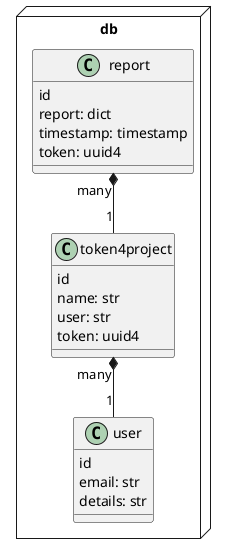

# PCD-HW-2

# Overview

We build a platform that a user have real-time monitoring for errors.


## Containers

### snap4frame (python package)

The component that listen for exception in python projects. When a exception occurs a report is generated with debug information.

### digest-endpoint (google function)

This receives reports from `snap4frame` and store in dp.

This require a token pregenerated.

```sh
POST https://europe-west9-analog-daylight-377117.cloudfunctions.net/storeProjectStackTrace?token={project_token}"
```

```plauml

```

### db-store (datastore google service)

It is responsible to store all persistance information



### pub/sub dist (pub/sub google service)

When a new report is publish a new message is created. All subscribers well receive a notification and will be `up-to-date`

### platform-backend (server + websocket)

The backend for mainly responsibility:

1. receive socket connection
2. receive/switch project selection
4. subscribe to `pub/sub dist` for news from a project (unsubscribe for old one)
5. when receive a message from subscription forward via web-socket connection

### platform-frontend (static sever)

The user interface

